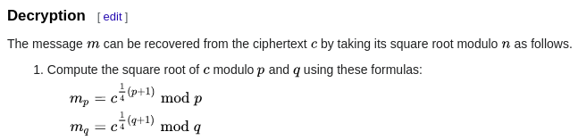

# eazy RSA
```
c = 3708354049649318175189820619077599798890688075815858391284996256924308912935262733471980964003143534200740113874286537588889431819703343015872364443921848
e = 16
p = 75000325607193724293694446403116223058337764961074929316352803137087536131383
q = 69376057129404174647351914434400429820318738947745593069596264646867332546443
```

Seems like an easy RSA question given `p` and `q`

But if you look carefully, you will notice the **`e` is an unusual number: `16`**

Looking the [wikipedia of RSA](https://en.wikipedia.org/wiki/RSA_(cryptosystem)) at the Key generation part:

*Choose an integer e such that 1 < e < λ(n) and gcd(e, λ(n)) = 1; that is, e and λ(n) are coprime* 

We know `λ(n) = (p-1)*(q-1)`, it should be an even number

So if `e` is even number, the GCD (Greatest Common Divisor) of `e` and `λ(n)` confirm not equal 1!

**Therefore, we cannot use the RSA method to calculate the private key and decrypt the ciphertext!**

## Rabin Cryptosystem

When I use the `e` is even, remind me of [Rabin Cryptosystem](https://en.wikipedia.org/wiki/Rabin_cryptosystem)

Because this cryptosystem is very similar to RSA, except `e` must be 2 and the decryption process

The key generation part stated that:
- When `p`,`q` divided by 4, the remainder must = 3 (Because 3 mod 4)

Means `p mod 4 = 3` and `q mod 4 = 3`

Verify that with python:
```py
>>> p = 75000325607193724293694446403116223058337764961074929316352803137087536131383
>>> q = 69376057129404174647351914434400429820318738947745593069596264646867332546443
>>> p % 4
3L
>>> q % 4
3L
```
Looks like it should be rabin!

Lets try to decrypt it using rabin method!

I refer the code from this [CTF writeup](https://ctftime.org/writeup/13748) to implement the rabin decryption

(egcd) Extended Euclidean Algorithm taken from [here](https://stackoverflow.com/questions/4798654/modular-multiplicative-inverse-function-in-python)

```py
from Crypto.Util.number import *
c = 3708354049649318175189820619077599798890688075815858391284996256924308912935262733471980964003143534200740113874286537588889431819703343015872364443921848
e = 16
p = 75000325607193724293694446403116223058337764961074929316352803137087536131383
q = 69376057129404174647351914434400429820318738947745593069596264646867332546443
phi = (p-1)*(q-1)
n = p*q

def egcd(a, b):
	if a == 0:
		return (b, 0, 1)
	else:
		g, y, x = egcd(b % a, a)
		return (g, x - (b // a) * y, y)

g ,yp, yq = egcd(p,q)
mp = pow(c,(p+1)/4,p)
mq = pow(c,(q+1)/4,q)

r = (yp*p*mq + yq*q*mp) % n
mr = n - r
s = (yp*p*mq - yq*q*mp) % n
ms = n - s
for num in [r,mr,s,ms]:
	print(long_to_bytes(num))
```
Result:
``` 
Y�-���
���h�$"�����P�&*l��7J7������˩~#�||!�{��̽�
	ȩ�ä�	�c�a]y+�4˙��Bj
��p
�n�T�	 ��a=M,ۮ�RVs�/�Pv�9�
J�b|_�+YϮDQ���hZWz���v#ډ�dɖg����PhT̑��l'��a�l��
�u��X�E�s48�h#��F8��rW"�1*$�a$�/��
```
All garbage, seems like it does not work..

After this, I look back the how the rabin decryption works

Notice `mp` and `mq` is the square root of `c` modulo `p` and `q`



In rabin, it uses `e = 2`, but this question uses `e = 16`

So if we do **square root 4 times**, I guess it should work for this question (Because 2^4 = 16)

Then I change my script abit:
```py
mp = pow(c,(p+1)/4,p)
mq = pow(c,(q+1)/4,q)

for i in range(3):
	mp = pow(mp,(p+1)/4,p)
	mq = pow(mq,(q+1)/4,q)

r = (yp*p*mq + yq*q*mp) % n
mr = n - r
s = (yp*p*mq - yq*q*mp) % n
ms = n - s
for num in [r,mr,s,ms]:
	print(long_to_bytes(num))

# flag{d0nt_h4v3_4n_3v3n_3_175_34sy!!!}
# cX��c��px�B�|^P�xW�P�4 2p�-H%u����� �����˛o	�d�Mo�?4`
# A�MFI�ݴ�qyj�� ��סfNf�Ͱ�4/z�-���^עU��~r�1!�R�E'�Cظ�
# !Ɋ��b�9�!�VN���v;�D�gR���eH��
# Ke=f7�}��⋄d��J��<��P�>
```
Run it, and I got the flag!!

[Full python script](solve.py)

Alternatively, you can calculate the 16th root with this two statement instead of repeat 4 times:
```py
mp = pow(c,((p+1)/4)**4,p)
mq = pow(c,((q+1)/4)**4,q)
```

## Flag
> flag{d0nt_h4v3_4n_3v3n_3_175_34sy!!!}